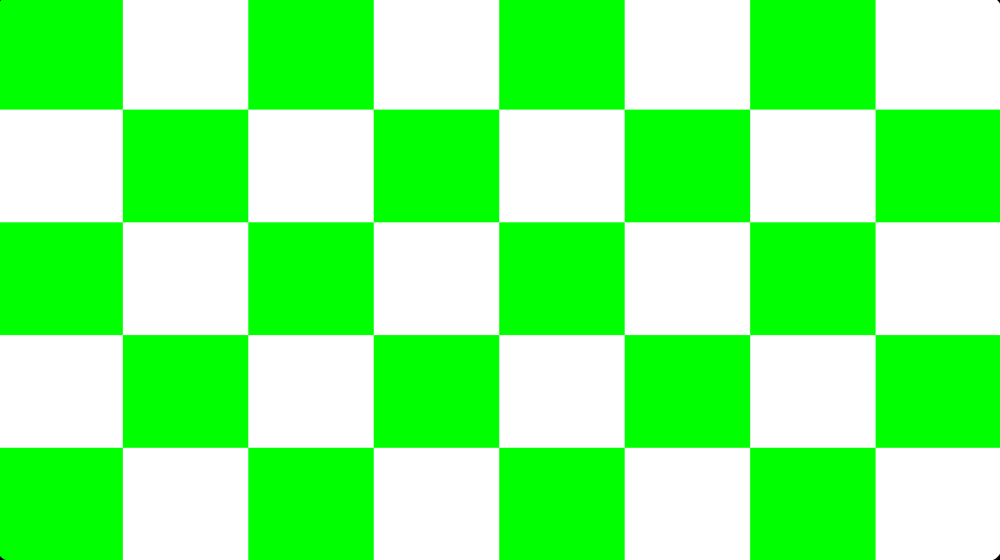

# Custom 16-bit CPU Emulator with VGA

A **16-bit CPU emulator written in C++** with **memory-mapped I/O (MMIO)** and a simple **VGA graphics device** implemented using SDL2.  
This project is built for learning and experimentation with CPU design, instruction sets, MMIO, and basic graphics rendering.

---

## Features

### CPU
- 16-bit architecture
- 16 general-purpose registers (**R0–R15**)
  - **R0 is a zero register (hardwired to value 0)**
- 16-bit program counter
- Zero flag (**Z**)
- 64KB system memory
- 64KB VRAM
- Arithmetic overflow / underflow checks
- Register-based and immediate addressing
- Memory-mapped I/O support

### VGA
- Resolution: **320 × 200**
- 8-bit indexed color framebuffer
- 256-color palette
- SDL2-based rendering
- Memory-mapped framebuffer access

---

## Instruction Set

| Opcode | Instruction | Description |
|------:|------------|------------|
| 0x00 | NOP | No operation |
| 0x01 | LDI r, imm8 | Load immediate (low byte) |
| 0x13 | LUI r, imm8 | Load immediate (high byte) |
| 0x02 | MOV r1, r2 | Copy register |
| 0x03 | ADD r1, r2 | Add registers |
| 0x04 | SUB r1, r2 | Subtract registers |
| 0x05 | JMP addr | Jump to address |
| 0x06 | JZ addr | Jump if zero |
| 0x0C | JNZ addr | Jump if not zero |
| 0x07 | CMP r1, r2 | Compare registers |
| 0x08 | LD r, addr | Load from memory |
| 0x09 | ST r, addr | Store to memory / MMIO |
| 0x11 | LD r1, r2 | Load from address in register |
| 0x12 | ST r1, r2 | Store to address in register |
| 0x0E | MUL r1, r2 | Multiply registers |
| 0x0F | DIV r1, r2 | Divide registers |
| 0x10 | MOD r1, r2 | Modulo |
| 0x0B | INC r | Increment register |
| 0x0A | OUT r | Print register value |
| 0x14 | JMPR r | Jump to address in register |
| 0x15 | JZR r | Jump if zero (register) |
| 0x16 | JNZR r | Jump if not zero (register) |
| 0x0D | PRTSTR addr | Print null-terminated string |
| 0xFF | HALT | Stop execution |

---

## Memory-Mapped I/O

### CPU MMIO Addresses

| Address | Function |
|-------:|---------|
| 0xFF00 | Output character (low byte) |
| 0xFF01 | VRAM address low byte |
| 0xFF02 | VRAM address high byte |
| 0xFF03 | Write pixel to VRAM |
| 0xFF06 | Trigger VGA present |

### VGA MMIO

| Address | Function |
|-------:|---------|
| 0x0000–FB_SIZE | Framebuffer |
| 0xFF10 | Present framebuffer |

---

## VGA Details

- Resolution: **320 × 200**
- Framebuffer layout:  
  `address = y * WIDTH + x`
- Each pixel stores an 8-bit color index
- Palette includes grayscale and predefined colors

---

## Project Structure

```
.
├── assembler
│   └── assembler.py
├── cpu
│   ├── cpu.cpp
│   └── cpu.hpp
├── vga
│   ├── vga.cpp
│   └── vga.hpp
├── program
│   └── <program_name>
│         ├── program.asm
│         └── program.hex
├── memory
│   └── data.txt
├── main.cpp
└── README.md
```

---

## Build Requirements

- C++17 compatible compiler
- SDL2 development libraries
- Python 3 (for the assembler)

---

## Assemble
```bash
python ./assembler/assembler.py ./program/<program_name>/program.asm ./program/<program_name>/program.hex
```


## Build

```bash
g++ main.cpp ./cpu/cpu.cpp ./vga/vga.cpp -o main $(sdl2-config --cflags) $(sdl2-config --libs) -lSDL2 -lSDL2main
```

---

## Run

```bash
./main ./program/<program_name>/program.hex ./memory/data.txt
```

---

**Each example has a run.sh script for easy execution.**

## Example Program:
```asm
; Checkerboard 320x200, 40x40 blocks
; Colors: green=2, white=5

LDI R4, 0x40      ; screen width low
LUI R4, 0x01      ; screen width high -> 320
LDI R5, 200       ; screen height = 200
LDI R6, 40        ; block size
LDI R7, 0         ; y counter
LDI R12, 1        ; for CMP
LDI R13, 2        ; for MOD
LDI R14, 0        ; x counter
LDI R15, 0        ; available for temp calculations

row_loop:
    MOV R14, R0    ; reset x counter (R15 is 0)

col_loop:
    ; Compute VRAM address = y*width + x
    ; Use R15 as temp register for calculations
    MOV R15, R7
    MUL R15, R4      ; R15 = y * width
    ADD R15, R14     ; R15 = y*width + x
    MOV R9, R15      ; save VRAM address in R9

    ; Compute block indices
    MOV R1, R7
    DIV R1, R6       ; y/block -> R1 = y_block
    MOV R2, R14
    DIV R2, R6       ; x/block -> R2 = x_block
    ADD R1, R2       ; R1 = x_block + y_block
    MOV R2, R13      ; R2 = 2
    MOD R1, R2       ; R1 = (x_block + y_block) % 2

    LDI R3, 2        ; default green
    CMP R1, R12      ; compare with 1
    JZ set_white
    JMP draw_pixel

set_white:
    LDI R3, 5        ; white color

draw_pixel:
    ; Write VRAM address (low/high)
    ; VRAM address low byte
    MOV R15, R9      ; get VRAM address from R9
    ST R15, 0xFF01   ; write low byte
    
    ; VRAM address high byte
    MOV R15, R9
    ST R15, 0xFF02   ; write high byte

    ; Write color and draw
    ST R3, 0xFF03

    ; Increment x
    INC R14
    CMP R14, R4
    JNZ col_loop

    ; Increment y
    INC R7
    CMP R7, R5
    JNZ row_loop

; Trigger VGA present
LDI R1, 1
ST R1, 0xFF06

HALT
```

## Output



## Notes

- R0 always reads as **0**
- Division by zero and arithmetic overflow halt execution
- VGA output is immediate and software-rendered
- Designed for educational and experimental purposes

---

## License

MIT License  © Tamvir Adar